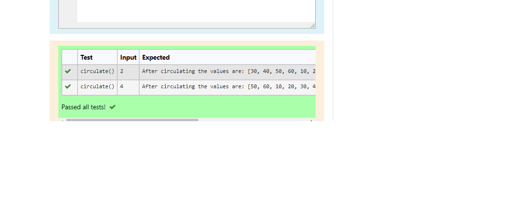

# Circulate-the-values-of-N-variables
## Aim:
To write a python program to circulate the n variables using function concept
## Equipment’s required:
PC
Anaconda - Python 3.7
## Algorithm: 
### Step 1: 
Create the program.
### Step 2: 
Assign the list.
### Step 3: 
Get the value from the user for the number of rotation
### Step 4: 
Using the slicing concept rotate the list
### Step 5:
Display the output of the progrm.
### Step 6: 
End the program
## Program:
```
#Program to circulate N values.
#Developed by:Popuri Siva Naga Nithin 
#RegisterNumber:21003942
def circulate():
    num1=[10,20,30,40,50,60]
    n=int(input())
    num1=num1[n:]+num1[:n]
    print("After circulating the values are:",num1)
 ```

## Output:



## Result:
Then circulating the values completed successfully.
